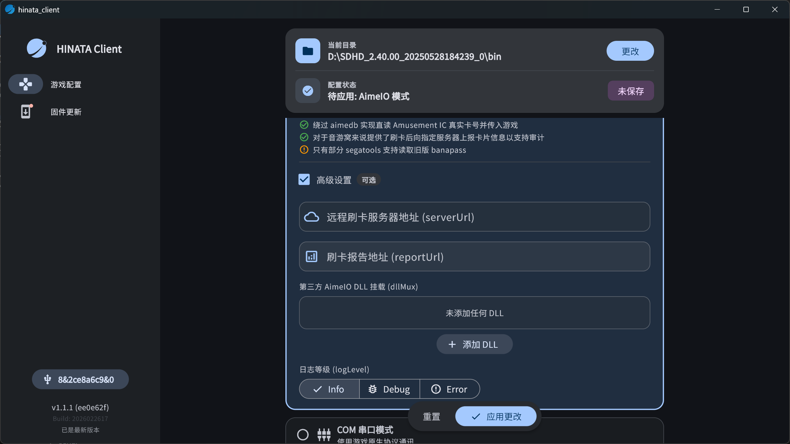
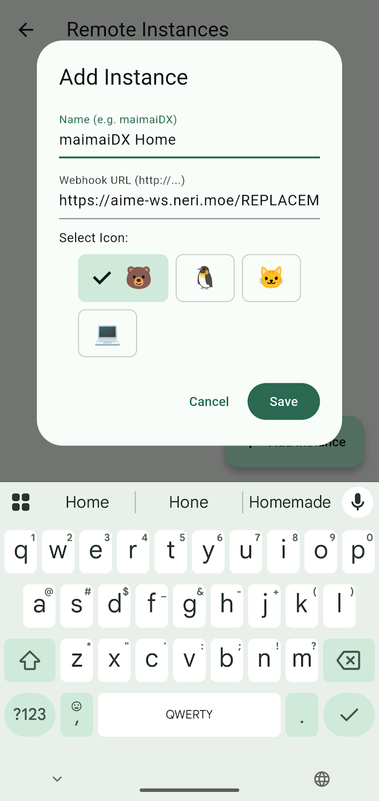

# HINATA Go
配合 HINATA AimeIO 让你的手机变成刷卡器或扫码游玩舞萌dx，并可以与 HINATA 读卡器等设备协同使用。

## Usage
**以下配置均已 HINATA 公共刷卡服务器 ( aime-ws.neri.moe ) 为例，请确保你的网络环境可以正常访问 Cloudflare 的服务**
1. 首先在你的游戏部署 [HINATA AimeIO](https://hinata.neri.moe/game-setting/sega/hinata-client/) ，然后配置远程刷卡服务器，使用文本直接编辑或使用 HINATA Client 图形化编辑均可：
    ```ini
    [aime]
    enable=1

    [aimeio]
    path=hinata.dll
    serverUrl=wss://aime-ws.neri.moe/REPLACEME
    ```
    

    **将REPLACEME替换为你自定义的一串英文字符串，并确保够唯一，否则可能会和他人重复**
2. 在 [Release](https://github.com/nerimoe/hinata_go/releases) 内下载最新版本的 HINATA Go，安装并打开
3. 在软件内添加一个 Instance，名称自定义，URL 则配置为 `https://aime-ws.neri.moe/REPLACEME`，如图所示：

4. 打开游戏开始玩？！

## 关于一些小特色功能

* 依托于公共刷卡服务器，手机和游戏机在不同网络环境下也可以正常使用
* 可以通过二维码获取卡号并传入游戏
* Amusement IC 卡片也受到完整支持
* 依托于 HINATA AimeIO ，HINATA Go 也可以实现正常读取旧版 Banapass，前提是你使用受支持的 segatools。
* 同样依托于 HINATA AimeIO，实现与回车刷卡共存，与实体读卡器共存，依托于 dllMux 功能与手台，amnet，mageki等各种其他刷卡方案共存
* 可通过 Android 系统的 Intent 来刷卡拉起该应用，快速向目标实例发送卡号
* 完整的符合 Material Design 3 的 UI 与图标